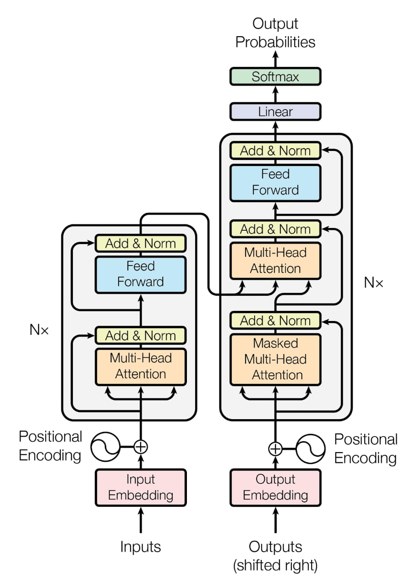

# Transformers from Scratch

A hands-on implementation of the core components of the Transformer architecture using NumPy — built from the ground up to understand how attention mechanisms and positional encoding work under the hood.

